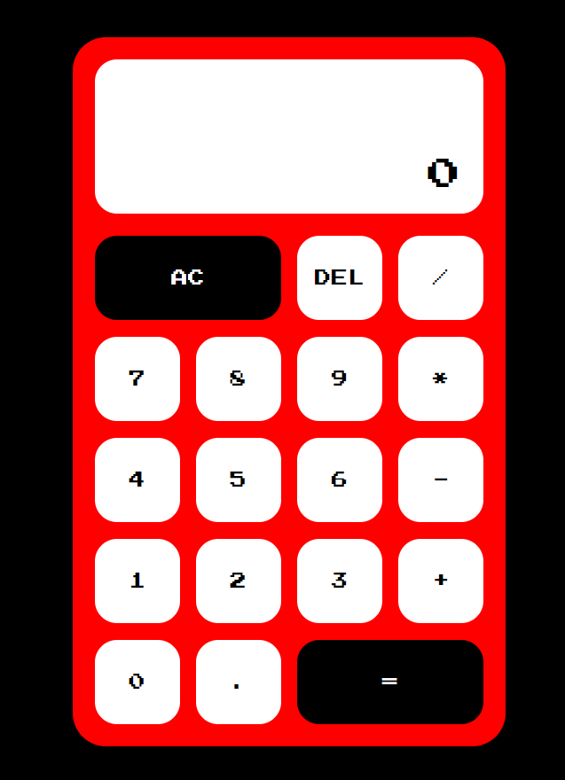
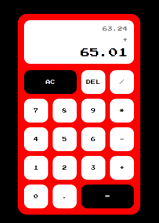
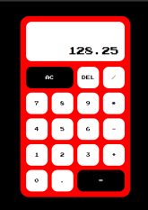

# Calculator App

The Calculator App is a simple calculator that allows you to perform basic mathematical operations such as addition, subtraction, multiplication, and division.

## Features
- Basic arithmetic operations: addition, subtraction, multiplication, and division.
- Clear button: resets the calculator to zero.
- Decimal point: allows you to input decimal numbers.
- Delete button: removes the last digit entered.

## Getting started
To use the Calculator App, simply follow these steps:

1. Clone the repository to your local machine.
2. Install the necessary dependencies by running the following command: `npm install`.
3. Start the app by running the command: `npm start`.
4. Open your web browser and navigate to `http://localhost:3000` to view the app.

## Usage
The Calculator App is very easy to use. Simply click on the buttons to input numbers and mathematical operations. The result will be displayed in the calculator's display area.

To clear the calculator, click on the "AC" button.

To delete the last digit entered, click on the "DEL" button.

## Technologies used

- ReactJS
- Styled-components